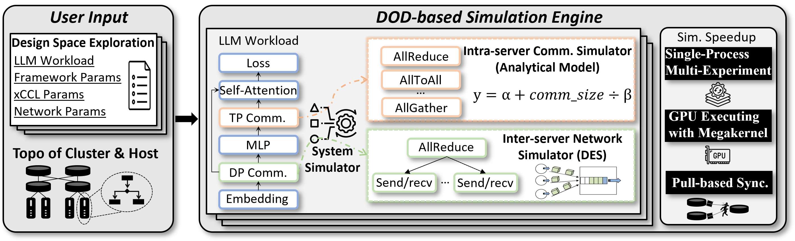

# Multiverse 2.0

Multiverse 2.0​​ is a next-generation, GPU-accelerated AI/LLM training simulator designed for high-performance and high-fidelity large-scale AI/LLM system research. In this version, both the system and network layers are fully GPU-accelerated while retaining CPU-only execution support for compatibility and testing. All components have been re-architected using Data-Oriented Design (DOD) principles to maximize simulation efficiency.


>  **Note:** In Multiverse 2.0, the system and network layers run within the same process, eliminating the need for shared memory communication between them.

  


## What's New in 2.0

  

-  **Full GPU Acceleration**: Both the system simulator and network simulator leverage GPUs for significant speedup. CPU-only execution remains available for compatibility and testing.

-  **Unified Data-Oriented Design**: The entire simulator is redesigned with DOD principles to optimize data locality and throughput.

-  **Simplified Architecture**: The system and network layers now operate in the same process, removing the need for shared memory communication.

-  **Flexible Input Pipeline**: Simulation scenarios are defined using Chakra files, further optimized with AIOB for efficient parsing and preprocessing.

  

  

## Table of Contents

  

- [Key Features](#key-features)

- [Architecture Overview](#architecture-overview)

- [Build Multiverse](#build-multiverse)

- [Build with Docker (TBD)](#build-with-docker-tbd)

- [Build Manually](#build-manually)

- [Run Multiverse](#run-multiverse)

- [Dependencies](#dependencies)

- [Future Work](#future-work)

- [Contributing](#contributing)

- [Contact Us](#contact-us)

- [License](#license)

  

---

  

## Key Features

  

-  **System Simulator**: Emulates large-scale LLM training systems, supporting parallel strategies (TP, DP), collective communication algorithms (e.g., Ring AllReduce), and advanced congestion control (DCQCN). Efficiently runs on both CPU and GPU.

-  **Network Simulator**: Models advanced network topologies (Fattree, BCube, HPN) and high-performance collective communication, with full GPU acceleration and DOD.

-  **Flexible Configuration**: Input via Chakra files, with biob optimization for rapid scenario deployment and reproducibility.

  

  

## Architecture Overview

  





  

## Build Multiverse  

### Build with Docker (TBD)


  

### Build Manually

 Ensure you have the dependencies listed in [Dependencies](#dependencies).

Fetch the repository (don't forget the `--recursive`!):


```bash
git  clone  --recursive  https://github.com/harnets/multiverse.git

cd  multiverse

```

 

For **Linux and macOS**: build the simulator with CMake and Make:

  

```bash
mkdir  build

cd  build

cmake  ..

make  -j  # Use the number of cores you prefer

cd  ..

```

  

Set up the Python components of the repository with pip:

  

```bash
pip  install  -e  .

```

  

  

## Run Multiverse

  

After building, you can run a built-in example to verify your installation:

  

```bash
cd  your_directory/multiverse/

bash  run.sh

```

  

  

## Dependencies

  

### Supported Platforms

  

- **Linux:** Ubuntu 18.04 or newer

- Other distributions with equivalent or newer kernel / GLIBC versions are also supported

  

### General Dependencies

  

- CMake 3.24 (or newer)

- Python 3.9 (or newer)

  

### GPU-Backend Dependencies


- Volta or newer NVIDIA GPU

- CUDA 12.5 (plus appropriate NVIDIA drivers).

- **Linux Only:** CUDA on Windows lacks certain unified memory features required by Madrona.

  

If these dependencies are not present, Madrona's GPU backend will be disabled, but you can still use the CPU backend.

  

## Future Work

|                              |                 |                            |                       |          |
| ---------------------------- | --------------- | -------------------------- | --------------------- | -------- |
| **Strategy/Algorithm**       | TP✔️             | DP✔️                        | PP                    | EP✔️      |
| **Collective Communication** | Ring allreduce✔️ | Halving doubling allreduce | Binary tree allreduce | /        |
| **Topology**                 | Fattree✔️        | HPN                        | Rail-optimized        | Bcube    |
| **Congestion Control**       | DCQCN✔️          | HPCC                       | Timely                | Poseidon |
| **Scale up network DES**     | PCIe            | NVLINK                     | TTPoE                 | UALink   |

✔️ indicates that the corresponding feature is ready in Multiverse 2.0. Others are planned for future releases.


## Contributing

Contributions are welcome! Feel free to report issues or submit pull requests. Please follow our contribution guidelines.


## Contact Us

[multiverse@harnets.ai](mailto:multiverse@harnets.ai)


## License

This project is licensed under the MIT License.
